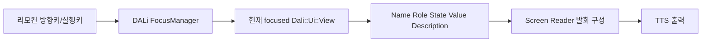

# Accessibility

[→ English](https://github.sec.samsung.net/NUI/dali-ui/wiki/Accessibility)

> 대상: DALi UI 기반 TV Application 개발자와 Component 개발자
> 기준일: 2026-08-04
> 구현 기준: `dali-ui` `5fd24a718692`
> 상태: Current with known component gaps

이 문서는 TV 화면을 구성하는 Application 개발자와 재사용 UI를 만드는 Component 개발자가 함께 사용하는 접근성 가이드입니다. 접근성의 기본 개념과 TV UX 명세부터 DALi UI 구현과 검증까지 하나의 흐름으로 설명합니다. 모든 구현 예제는 C++ `Dali::Ui` API를 사용합니다.

<br/>

## 1. 빠른 시작

독자 | 먼저 읽을 내용 | 완료 기준
--|--|--
Application 개발자 | 접근성 기본 개념 → TV UX 명세 → Application 개발자 가이드 → 검증 | 리모컨과 Screen Reader만으로 핵심 작업을 완료
Component 개발자 | 접근성 기본 개념 → TV UX 명세 → Component 개발자 가이드 → 검증 | role, state, action, tree contract를 충족

먼저 기억할 원칙은 다음과 같습니다.

1. Screen Reader가 켜져 있는지와 관계없이 Name, Role, State, Value, Description 등의 접근성 정보를 항상 설정합니다.
2. Name에는 대상의 짧은 이름만 넣고 Role, State, Value를 중복해서 합치지 않습니다.
3. TV remote의 keyboard focus와 accessibility highlight를 같은 상태로 취급하지 않습니다.
4. Application은 화면 문맥과 content semantic을, Component는 기본 semantic과 action contract를 책임집니다.
5. API를 설정한 뒤에는 AT-SPI tree와 실제 TV Screen Reader 동작을 모두 검증합니다.

<br/>

## 2. 접근성 기본 개념

### 2.1 접근성이란

접근성은 장애 여부와 관계없이 모든 사람이 제품과 서비스를 사용할 수 있도록 설계하고 구현하는 것입니다. TV에서는 화면을 보지 않고도 리모컨으로 현재 위치를 파악하고, 콘텐츠를 탐색하며, 원하는 기능을 실행할 수 있어야 합니다.

### 2.2 Screen Reader와 TTS

TTS는 전달받은 텍스트를 음성으로 바꾸는 기술입니다. Screen Reader는 UI object를 탐색하고 semantic과 현재 context를 조합해 발화 정보를 만들며, 사용자 입력을 action으로 전달하는 접근성 도구입니다.

```text
TTS: 애플리케이션이 완성된 문장을 전달 → 음성 출력
Screen Reader: UI semantic + 현재 context → 발화, 탐색, action
```

따라서 Application이나 Component가 최종 발화 문장을 직접 조립하거나 TTS를 개별 호출하는 대신, 각 View의 의미와 상태를 정확히 제공해야 합니다.

### 2.3 접근성 semantic

정보 | 의미 | TV 예
--|--|--
Name | 사용자가 대상을 식별하는 짧은 이름 | `"Netflix"`, `"음량"`
Role | 대상의 기능 | `BUTTON`, `CHECK_BOX`, `ADJUSTABLE`
State | 선택, 체크, 비활성 등 현재 상태 | `CHECKED`, `SELECTED`, `ENABLED`
Value | 조절값이나 진행값 | `"50%"`, `"3/10"`
Description | 이름을 보충하는 설명이나 꼭 필요한 사용 안내 | `"사용 가능한 네트워크를 엽니다"`

예상 발화가 “음량, 조절 가능, 50%”라면 Name에 전체 문장을 넣지 않습니다. Name은 `"음량"`, Role은 `ADJUSTABLE`, Value는 `"50%"`로 분리합니다. 실제 단어와 순서는 locale과 Screen Reader 정책이 결정합니다.

### 2.4 AT-SPI

AT-SPI는 Linux/Tizen에서 Screen Reader 같은 assistive technology와 UI 애플리케이션이 상호작용하기 위한 접근성 interface입니다. Application은 DALi View에 semantic을 선언하고, DALi UI와 adaptor가 이를 접근성 tree와 AT-SPI interface로 변환합니다. 일반 Application이나 Component가 D-Bus protocol 또는 AT-SPI object를 직접 구현하지 않습니다.

<br/>

## 3. Tizen TV 접근성 동작

### 3.1 TV remote focus 흐름

TV 제품의 일반적인 remote 탐색 흐름은 다음과 같습니다. 제품 branch의 Screen Reader integration 방식에 따라 세부 경로는 달라질 수 있지만, Application과 Component의 contract는 같습니다.



방향키는 `FocusManager`를 통해 keyboard focus를 이동합니다. Screen Reader가 활성화된 경우 현재 대상의 semantic을 이용해 사용자가 어디에 있고 무엇을 할 수 있는지 설명합니다. 실행키, touch, accessibility action은 같은 기능과 상태 변경 경로로 모여야 합니다.

### 3.2 Keyboard focus와 accessibility highlight

> [!IMPORTANT]
> **Keyboard focus와 accessibility highlight는 서로 다른 상태입니다.** `FocusManager`의 focus는 리모컨과 키 입력 대상을 정합니다. Accessibility highlight는 Screen Reader가 읽는 대상을 나타냅니다. View를 focusable로 만들어도 accessibility semantic이 자동으로 생기지 않으며, highlight를 이동해도 keyboard focus는 자동으로 바뀌지 않습니다.

TV UX 명세와 테스트 결과에는 어떤 상태를 의미하는지 명확히 기록하세요. “focus 이동”이라는 표현만 쓰면 remote focus와 Screen Reader highlight가 혼동될 수 있습니다.

<br/>

## 4. TV 접근성 UX 명세

UX 단계에서 시각 배치만 전달하면 개발자와 QA가 접근성 탐색 단위와 발화를 추측하게 됩니다. 화면 또는 Component 명세에 다음 정보를 함께 기록하세요.

UX 항목 | 반드시 정할 내용 | 예
--|--|--
방향 focus | 좌/우/상/하 이동 대상과 경계 동작 | modal의 마지막 항목에서 배경으로 빠져나가지 않음
초기 focus | 화면이나 modal 진입 직후 첫 대상 | dialog 제목 또는 주 action
focus 복귀 | 닫기 또는 back 이후 돌아갈 대상 | dialog를 연 버튼
grouping | root 하나로 읽을지, child를 각각 탐색할지 | 설정 icon + label + toggle을 하나의 대상 구성
이미지 처리 | 정보 이미지의 이름 또는 decorative 제외 | 할인 banner는 설명, divider는 tree에서 숨김
semantic 기대값 | Name, Role, State, Value, Description | Name `음량`, Role `ADJUSTABLE`, Value `50%`
상태 feedback | action 직후 바뀌어야 할 semantic | toggle 조작 후 `CHECKED` 즉시 갱신
반복 콘텐츠 | heading, collection 이름, index 정책 | episode card `3/10`
동적 콘텐츠 | 발화 빈도와 interruption 정책 | 통화 시간을 매초 읽지 않음

### 4.1 방향 focus, 초기 focus, 복귀

- 시각적으로 가까운 대상이 아니라 사용자의 작업 순서에 맞춰 방향 focus를 설계합니다.
- 화면, tab, modal 진입 시 논리적인 첫 대상을 하나 정합니다.
- modal이나 하위 화면을 닫은 뒤에는 사용자가 출발한 대상 또는 다음 작업에 적합한 대상으로 복귀합니다.
- 순환 탐색, 경계 이탈, 예외적인 focus 이동은 UX 명세에 화살표나 표로 표시합니다.

### 4.2 Grouping과 탐색 단위

아이콘, label, toggle이 하나의 설정을 나타낸다면 root 하나가 Name, Role, State, action을 대표하고 내부 장식 View는 중복 탐색되지 않게 합니다. 반대로 child마다 별도 action이 있다면 root와 합치지 말고 각 child를 독립된 대상으로 제공합니다.

좋은 grouping은 사용자의 탐색 횟수를 줄이지만, 여러 action을 하나의 모호한 대상에 숨기면 안 됩니다. “한 번의 탐색으로 이해할 정보”와 “독립적으로 실행할 action”을 함께 기준으로 결정하세요.

### 4.3 이미지 설명

- 정보 전달 이미지에는 시각 정보와 같은 목적의 간결한 Name을 제공합니다.
- 이미지 안의 중요한 텍스트가 다른 곳에 제공되지 않으면 Name에 의미를 포함합니다.
- 주변 텍스트와 중복되거나 순수 장식인 이미지는 accessibility tree에서 숨깁니다.
- `"image"`, `"icon"`처럼 Role이 이미 전달하는 단어를 Name에 반복하지 않습니다.

### 4.4 예상 발화와 상태 feedback

예상 발화 문장은 UX review 도구입니다. 실제 구현 contract는 문장을 구성하는 semantic 항목입니다.

```text
UX 예상: "음량, 조절 가능, 50%"
구현: Name="음량", Role=ADJUSTABLE, Value="50%"
```

선택, 체크, 펼침, 값 변경 같은 action 뒤에는 시각 상태와 semantic을 같은 model update에서 갱신합니다. 제품 고유의 결과 안내가 추가로 필요하면 기본 semantic feedback과 중복되거나 다른 발화를 끊지 않는지 함께 검토합니다.

### 4.5 반복 및 동적 콘텐츠

- 긴 화면은 heading과 의미 있는 collection으로 나눕니다.
- 반복 card에는 항목을 구분할 수 있는 Name과 최신 collection index를 제공합니다.
- recycling된 View에는 이전 항목의 Name, State, Value, index가 남지 않도록 전체 semantic을 다시 binding합니다.
- timer, progress, live status처럼 자주 바뀌는 값은 모든 변화가 중요한지 판단하고 발화 빈도를 제한합니다.
- loading이 길면 `BUSY` 상태와 사용자가 이해할 수 있는 현재 작업 정보를 제공합니다.

<br/>

## 5. DALi UI API 개요

`Dali::Ui::View`의 Accessibility API는 View의 의미, 읽을 정보, 상태와 관계를 접근성 트리에 전달합니다. Screen Reader는 이 정보를 조회하여 현재 highlighted View를 발화하고 접근성 action을 View에 전달합니다.

```cpp
#include <dali-ui-foundation/dali-ui-foundation.h>

using namespace Dali;
using namespace Dali::Ui;

View button = View::New();
button.SetAccessibilityRole(Accessibility::Role::BUTTON);
button.SetAccessibilityName("확인");
button.SetAccessibilityDescription("입력한 내용을 저장합니다");
button.AddAccessibilityReadingInfo(Accessibility::ReadingInfo::NAME);
button.AddAccessibilityReadingInfo(Accessibility::ReadingInfo::ROLE);
button.AddAccessibilityReadingInfo(Accessibility::ReadingInfo::DESCRIPTION);

window.Add(button);
```

Keyboard focus와 accessibility highlight의 차이는 [Tizen TV 접근성 동작](#3-tizen-tv-접근성-동작)을 참고하세요.

<br/>

## 6. 기본 정보 설정

Screen Reader가 View를 이해하는 데 필요한 기본 정보는 name, description, value, role입니다.

API | 용도 | 예
--|--|--
`SetAccessibilityName()` | 사용자가 대상을 식별할 짧은 이름 | `"Wi-Fi"`
`SetAccessibilityDescription()` | 이름을 보충하는 설명 | `"사용 가능한 네트워크를 엽니다"`
`SetAccessibilityValue()` | 현재 값 | `"50%"`, `"켜짐"`
`SetAccessibilityRole()` | 대상의 의미와 지원 동작 | `BUTTON`, `ENTRY`, `ADJUSTABLE`

```cpp
View volume = View::New();
volume.SetAccessibilityRole(Accessibility::Role::ADJUSTABLE);
volume.SetAccessibilityName("음량");
volume.SetAccessibilityValue("50%");
```

role은 View의 구현 클래스가 아니라 **사용자에게 제공하는 기능**에 맞게 선택합니다. 예를 들어 일반 `View`로 만든 클릭 가능한 컨트롤도 동작이 버튼이면 `BUTTON`을 사용합니다.

주로 사용하는 role은 다음과 같습니다.

분류 | Role
--|--
동작/선택 | `BUTTON`, `TOGGLE_BUTTON`, `CHECK_BOX`, `RADIO_BUTTON`, `LINK`
입력/값 | `ENTRY`, `PASSWORD_TEXT`, `ADJUSTABLE`, `SPIN_BUTTON`, `PROGRESS_BAR`, `SCROLL_BAR`
구조 | `CONTAINER`, `LIST`, `LIST_ITEM`, `TAB_LIST`, `TAB`, `MENU`, `MENU_ITEM`, `TOOL_BAR`
콘텐츠 | `TEXT`, `IMAGE`, `HEADER`, `SCENE_3D`, `MODEL`
컨텍스트 | `ALERT`, `NOTIFICATION`, `DIALOG`, `POPUP_MENU`

전체 role은 `Accessibility::Role`을 참고하세요. 의미 있는 role을 지정하면 기본적으로 highlightable 대상이 됩니다.

> [!NOTE]
> Component의 표시 content를 기본 Name/Description으로 사용할 때는 `OnAccessibilityRequestDefaultName()`과 `OnAccessibilityRequestDefaultDescription()`을 사용합니다. `OnAccessibilityRequestName/Description/Value()`는 explicit property보다 우선해야 하는 authoritative 값에만 사용합니다. 자세한 우선순위는 [동적 값과 Component 기본 Name/Description](#165-동적-값과-component-기본-namedescription)을 참고하세요.

<br/>

## 7. 접근성 동작 속성

```cpp
view.SetAccessibilityHidden(false);
view.SetAccessibilityHighlightable(true);
view.SetAccessibilityScrollable(false);
view.SetAccessibilityModal(false);
view.SetAutomationId("settings-wifi-button");
```

API | 설명
--|--
`SetAccessibilityHidden(bool)` | `true`이면 View를 접근성 client에서 숨깁니다. 장식용 View처럼 읽히면 안 되는 대상에 사용합니다.
`SetAccessibilityHighlightable(bool)` | role 기반 기본값 대신 highlight 가능 여부를 명시적으로 override합니다.
`ResetAccessibilityHighlightable()` | 명시적 override를 지우고 role 기반 동작으로 되돌립니다. role이 `NONE`이 아니면 기본적으로 highlightable입니다.
`SetAccessibilityScrollable(bool)` | View가 접근성 scroll 동작을 제공하는지 나타냅니다.
`SetAccessibilityModal(bool)` | 접근성 탐색 범위를 제한해야 하는 modal context임을 나타냅니다.
`SetAutomationId()` | UI 자동화 도구가 사용할 안정적인 식별자를 설정합니다.

각 setter에는 대응하는 `Is...()` 또는 `Get...()` API가 있습니다.

> [!WARNING]
> `SetAccessibilityHidden(true)`는 화면의 visibility를 변경하지 않습니다. 반대로 화면에서 보이지 않는 View를 접근성에서 노출해야 한다는 뜻도 아닙니다. 시각 상태와 접근성 노출 상태를 일관되게 관리하세요.

<br/>

## 8. 발화할 정보 선택

`Accessibility::ReadingInfo`는 Screen Reader가 View를 읽을 때 어떤 의미 정보를 사용할지 지정합니다. enum은 bit mask가 아니므로 항목별 API를 사용합니다.

```cpp
view.AddAccessibilityReadingInfo(Accessibility::ReadingInfo::NAME);
view.AddAccessibilityReadingInfo(Accessibility::ReadingInfo::ROLE);
view.AddAccessibilityReadingInfo(Accessibility::ReadingInfo::DESCRIPTION);
view.AddAccessibilityReadingInfo(Accessibility::ReadingInfo::STATE);

view.RemoveAccessibilityReadingInfo(Accessibility::ReadingInfo::DESCRIPTION);

if(view.HasAccessibilityReadingInfo(Accessibility::ReadingInfo::STATE))
{
  // STATE가 발화 정보에 포함되어 있음
}

view.ClearAccessibilityReadingInfo();
```

항목 | 전달하는 정보
--|--
`NAME` | `AccessibilityName`
`ROLE` | `AccessibilityRole`
`DESCRIPTION` | `AccessibilityDescription`
`STATE` | 현재 접근성 state

<br/>

## 9. State 관리

애플리케이션이나 component가 소유하는 의미 상태는 `AddAccessibilityState()`, `RemoveAccessibilityState()`, `ClearAccessibilityStates()`로 관리합니다.

```cpp
checkBox.AddAccessibilityState(Accessibility::State::ENABLED);
checkBox.AddAccessibilityState(Accessibility::State::CHECKED);

checkBox.RemoveAccessibilityState(Accessibility::State::CHECKED);
bool checked = checkBox.HasAccessibilityState(Accessibility::State::CHECKED);
```

State | 사용 시점
--|--
`ENABLED` | 접근성 interaction이 가능한 상태
`SELECTED` | 목록, tab 등의 항목이 선택된 상태
`CHECKED` | check/toggle 값이 켜진 상태
`BUSY` | 값 또는 콘텐츠를 갱신 중인 상태
`EXPANDED` | 접힌 콘텐츠가 펼쳐진 상태

이 API로 설정한 state는 visibility, sensitivity, focus 등 DALi가 계산하는 runtime state와 합쳐져 accessibility client에 노출됩니다. 따라서 `FOCUSED`, `SHOWING`, `HIGHLIGHTED` 같은 runtime state를 이 API로 직접 추가하지 않습니다.

<br/>

## 10. View 사이의 관계

화면 배치만으로 의미를 알 수 없는 경우 `Accessibility::RelationType`으로 View 사이의 관계를 표현합니다.

```cpp
View title = Label::New("비밀번호");
View input = View::New();
View error = Label::New("8자 이상 입력하세요");

title.AddAccessibilityRelation(Accessibility::RelationType::LABEL_FOR, input);
input.AddAccessibilityRelation(Accessibility::RelationType::LABELLED_BY, title);

error.AddAccessibilityRelation(Accessibility::RelationType::ERROR_MESSAGE, input);
input.AddAccessibilityRelation(Accessibility::RelationType::ERROR_FOR, error);
```

자주 사용하는 대응 관계는 다음과 같습니다.

소스 → 대상 | 대상 → 소스
--|--
`LABEL_FOR` | `LABELLED_BY`
`DESCRIPTION_FOR` | `DESCRIBED_BY`
`CONTROLLER_FOR` | `CONTROLLED_BY`
`FLOWS_TO` | `FLOWS_FROM`
`NODE_PARENT_OF` | `NODE_CHILD_OF`
`EMBEDS` | `EMBEDDED_BY`
`DETAILS` | `DETAILS_FOR`
`ERROR_MESSAGE` | `ERROR_FOR`

relation은 한 방향씩 저장되므로 client가 양쪽 관계를 조회해야 한다면 위 예제처럼 대응 관계를 각각 추가합니다.

```cpp
input.RemoveAccessibilityRelation(Accessibility::RelationType::LABELLED_BY, title);
input.ClearAccessibilityRelations();
bool exists = input.HasAccessibilityRelation(Accessibility::RelationType::LABELLED_BY, title);
```

대상 View는 weak handle로 보관되므로 대상이 소멸되었다고 relation 때문에 수명이 연장되지는 않습니다.

<br/>

## 11. 다국어 접근성 문자열

### 11.1 번역 resource 연결

name과 description을 `UiLocalizationManager` resource에 연결하면 locale 변경 시 번역된 값이 갱신됩니다.

```cpp
view.SetTranslatableAccessibilityName("IDS_SETTINGS_WIFI", "settings");
view.SetTranslatableAccessibilityDescription("IDS_SETTINGS_WIFI_DESCRIPTION", "settings");

Dali::String nameResourceId = view.GetTranslatableAccessibilityName();

view.ClearTranslatableAccessibilityName();
view.ClearTranslatableAccessibilityDescription();
```

domain 인자를 생략하면 default domain을 사용합니다. `SetAccessibilityName()`이나 `SetAccessibilityDescription()`으로 명시적 문자열을 다시 설정하면 해당 translation binding과 language span은 해제됩니다. localization 설정 방법은 [Localization & Multilingual UI](https://github.sec.samsung.net/NUI/dali-ui/wiki/Localization-&-Multilingual-UI-(kr))를 참고하세요.

플랫폼 screen reader가 이미 번역해 둔 문자열을 재사용하려면 `Extension::ScreenReaderLocalization`으로 조회한 뒤 결과를 명시적으로 설정합니다.

```cpp
#include <dali-ui-foundation/extension-api/screen-reader-localization.h>

view.SetAccessibilityName(Extension::ScreenReaderLocalization::GetLocalizedString("IDS_ACCS_TBOPT_BUTTON"));
```

이 catalog는 플랫폼 screen reader 패키지 소유이므로 해당 패키지가 없는 환경에서는 resource id가 그대로 fallback되며, 결과는 locale 변경 시 갱신되는 binding이 아니라 단순 문자열입니다. 자세한 내용은 [Screen Reader Catalog Lookup](https://github.sec.samsung.net/NUI/dali-ui/wiki/Localization-&-Multilingual-UI-(kr)#screen-reader-catalog-lookup)을 참고하세요.

### 11.2 한 문자열 안의 언어 구간

한 name 또는 description 안에 여러 언어가 섞여 있으면 language span을 추가합니다.

```cpp
view.SetAccessibilityName("Hello 세계");

bool english = view.AddAccessibilityNameLanguageSpan(0u, 5u, "en-US");
bool korean  = view.AddAccessibilityNameLanguageSpan(6u, 2u, "ko-KR");
```

`start`와 `length`는 UTF-8 byte offset이 아니라 **Unicode code point 기준**입니다. 길이가 0이거나 locale이 비어 있거나, 문자열 범위를 벗어나거나, 기존 span과 겹치면 `false`를 반환합니다.

description에는 `AddAccessibilityDescriptionLanguageSpan()`을 사용합니다. 문자열을 변경하면 기존 span이 제거되므로 문자열을 먼저 설정한 후 span을 추가하세요.

```cpp
view.ClearAccessibilityNameLanguageSpans();
view.ClearAccessibilityDescriptionLanguageSpans();
```

<br/>

## 12. Collection 정보

목록처럼 반복되는 항목에는 collection container와 zero-based index를 설정할 수 있습니다.

```cpp
list.SetAccessibilityCollectionContainer(true);

for(int32_t index = 0; index < itemCount; ++index)
{
  items[index].SetAccessibilityCollectionIndex(index);
}

items[0].ClearAccessibilityCollectionIndex(); // Get 결과는 -1
```

`SetAccessibilityCollectionIndex(-1)`도 index를 제거합니다. 항목 삽입, 삭제, 정렬 후에는 실제 순서와 index가 일치하도록 갱신하세요.

<br/>

## 13. 초기 highlight와 실행 중 highlight 이동

highlight 요청 시점에 따라 사용하는 API가 다릅니다.

상황 | API | 특징
--|--|--
페이지, window, modal이 처음 표시됨 | `View::SetRequestInitialAccessibilityHighlight(true)` | accessibility context를 구성할 때 Screen Reader가 초기 대상을 선택하도록 metadata를 제공합니다.
이미 표시된 안정적인 화면에서 대상을 즉시 이동 | `Extension::View::GrabAccessibilityHighlight(view)` | 현재 DALi accessibility highlight를 대상 View로 옮기고 `HIGHLIGHTED` 변경을 client에 알립니다.

### 13.1 페이지의 초기 highlight

페이지가 accessibility tree에 나타나기 전에 초기 대상을 지정합니다.

```cpp
View title = Label::New("네트워크 설정");
title.SetAccessibilityRole(Accessibility::Role::HEADER);
title.SetRequestInitialAccessibilityHighlight(true);

page.Add(title);
window.Add(page);
```

페이지가 사라지거나 재사용될 때 더 이상 초기 대상이 아니면 `SetRequestInitialAccessibilityHighlight(false)`로 해제합니다. 같은 context에 여러 초기 대상을 지정하면 최종 선택은 Screen Reader 정책에 따라 달라질 수 있으므로 논리적인 초기 대상 하나만 지정하는 것이 좋습니다.

> [!IMPORTANT]
> 새로운 페이지나 modal의 `SHOWING` 처리와 동시에 `GrabAccessibilityHighlight()`를 호출하면, Screen Reader의 context 재구성과 highlight 발화 요청이 서로 다른 비동기 작업으로 처리될 수 있습니다. 초기 화면은 `SetRequestInitialAccessibilityHighlight()`를 사용하고, `GrabAccessibilityHighlight()`는 화면 구성이 안정된 뒤 발생하는 명시적 사용자 동작에 사용하세요. 임의의 timeout으로 순서를 맞추는 방식은 권장하지 않습니다.

### 13.2 실행 중 강제 highlight 이동

이 API는 extension-api에 있으므로 extension header를 포함합니다.

```cpp
#include <dali-ui-foundation/extension-api/view.h>

bool moved = Dali::Ui::Extension::View::GrabAccessibilityHighlight(targetView);
if(!moved)
{
  // Screen Reader bridge가 비활성 상태이거나 highlight를 적용하지 못함
}
```

다른 View가 highlighted 상태라면 기존 highlight를 clear한 뒤 새 View로 이동합니다. `AccessibilityHighlightedSignal()`은 이전 View에 `false`, 새 View에 `true`로 발생하고 접근성 client에는 `HIGHLIGHTED` state 변경이 전달됩니다. Screen Reader는 이 변경을 바탕으로 새 대상을 발화할 수 있습니다.

> [!NOTE]
> 대상 View는 keyboard focusable일 필요가 없고 keyboard focus도 이동하지 않습니다. 다만 accessibility tree에 노출되고 화면 구성이 안정된 View를 대상으로 사용하세요. 일반적인 Screen Reader 탐색 가능 여부는 `SetAccessibilityHighlightable()`로 별도 관리합니다.

반환값의 의미는 다음과 같습니다.

* `true`: DALi에서 요청한 View가 highlight를 가진 상태입니다.
* `false`: accessibility bridge가 비활성 상태이거나 highlight를 적용/해제하지 못했습니다.

`true`는 Screen Reader가 발화를 시작하거나 완료했다는 acknowledgement가 아닙니다. 이미 같은 View가 highlighted 상태이면 `true`를 반환하지만 새로운 `HIGHLIGHTED` 이벤트를 보내지 않으므로 재발화 API로 사용할 수 없습니다.

```cpp
bool cleared = Dali::Ui::Extension::View::ClearAccessibilityHighlight(targetView);
```

`ClearAccessibilityHighlight()`는 해당 View가 현재 highlighted인 경우에만 `true`를 반환합니다.

<br/>

## 14. Accessibility signal

### 14.1 Highlight 변경

```cpp
view.AccessibilityHighlightedSignal().Connect(
  &tracker,
  [](View source, bool highlighted)
  {
    // source의 accessibility highlight가 변경됨
  });
```

signal type은 `Signal<void(View, bool)>`입니다. Screen Reader 탐색 또는 extension highlight API로 실제 상태가 변경될 때 발생합니다. signal은 상태 변경을 관찰하기 위한 것이므로 애플리케이션에서 직접 `Emit()`하지 않습니다.

### 14.2 읽기 lifecycle

```cpp
view.AccessibilityReadingStatusChangedSignal().Connect(
  &tracker,
  [](View source, Accessibility::ReadingStatus status)
  {
    switch(status)
    {
      case Accessibility::ReadingStatus::PAUSED:
        break;
      case Accessibility::ReadingStatus::RESUMED:
        break;
      default:
        break;
    }
  });
```

signal type은 `Signal<void(View, Accessibility::ReadingStatus)>`이며 다음 상태를 전달합니다.

Status | 의미
--|--
`SKIPPED` | 완료 전에 읽기가 건너뛰어짐
`PAUSED` | 읽기가 일시 정지됨
`RESUMED` | 일시 정지된 읽기가 재개됨
`CANCELLED` | 대기 중이거나 진행 중인 읽기가 취소됨
`STOPPED` | 읽기가 중지되거나 완료됨

<br/>

## 15. Application 개발자 가이드

Application은 접근성 interface를 직접 구현하는 대신, 화면의 content semantic과 현재 활성 context를 DALi View에 선언합니다. 사용하는 Component가 필요한 action contract를 제공하는지도 확인해야 합니다.

### 15.1 Application과 Component의 책임 경계

Application이 담당 | Component 또는 framework가 담당
--|--
화면 content의 Name, Value, State | 기능에 맞는 기본 Role과 action 구현
현재 page와 modal의 활성 subtree | AT-SPI object와 D-Bus bridge
초기 remote focus, 초기 accessibility highlight, 닫기 후 복귀 대상 | touch, key, accessibility action의 동일 기능 경로
정보 이미지와 decorative 이미지 구분 | 내부 child의 기본 tree 노출 정책
사용 Component의 contract 검증 | 재사용·recycling 시 semantic 동기화

Application에서 다음을 하지 마세요.

- `Dali::Accessibility::Accessible` 또는 adaptor bridge를 직접 구현하거나 제어
- Screen Reader가 켜졌을 때만 semantic을 설정하는 조건부 코드
- Name에 Role, State, Value를 붙여 최종 발화 문장을 만드는 코드
- page 전환 뒤 임의 timeout으로 highlight를 이동하는 코드
- Component action이 없는데 Role과 Value만 설정하고 조작 가능하다고 판단

### 15.2 화면 content semantic 설정

기능을 이미 구현한 Component 또는 View에 화면별 content를 설정합니다.

```cpp
#include <string>

void ConfigureVolumeControl(View control, int volume)
{
  control.SetAccessibilityRole(Accessibility::Role::ADJUSTABLE);
  control.SetAccessibilityName("음량");
  control.SetAccessibilityValue((std::to_string(volume) + "%").c_str());
  control.SetAutomationId("settings.sound.volume");
}
```

이 코드는 화면별 semantic을 선언합니다. 증가·감소 동작은 Component가 `OnAccessibilityValueChange()`로 구현해야 합니다. Role과 Value만으로 action이 생기지는 않습니다.

복합 설정을 root 하나로 탐색하게 할 때는 내부의 중복 정보를 숨깁니다.

```cpp
void ConfigureAudioDescriptionSetting(View control,
                                      View icon,
                                      View visibleLabel,
                                      bool checked)
{
  control.SetAccessibilityRole(Accessibility::Role::TOGGLE_BUTTON);
  control.SetAccessibilityName("화면 해설");

  if(checked)
  {
    control.AddAccessibilityState(Accessibility::State::CHECKED);
  }
  else
  {
    control.RemoveAccessibilityState(Accessibility::State::CHECKED);
  }

  icon.SetAccessibilityHidden(true);
  visibleLabel.SetAccessibilityHidden(true);
}
```

root가 실제 toggle action을 제공할 때만 위처럼 grouping합니다. icon이나 label에 독립 action이 있으면 각각 접근 가능한 대상으로 유지하세요.

### 15.3 Page와 remote focus lifecycle

가려진 page가 탐색되지 않도록 시각 visibility와 accessibility subtree를 함께 관리합니다.

```cpp
void SetPageActive(View page, bool active)
{
  page.SetVisible(active);
  page.SetAccessibilityHidden(!active);
}
```

새 page를 표시하기 전에 accessibility 초기 대상을 하나 지정합니다.

```cpp
Label title = Label::New("네트워크 설정");
title.SetAccessibilityRole(Accessibility::Role::HEADER);
title.SetRequestInitialAccessibilityHighlight(true);
page.Add(title);
```

리모컨의 초기 keyboard focus는 `FocusManager`로 별도 요청합니다.

```cpp
bool FocusFirstControl(View firstControl)
{
  return FocusManager::Get().RequestFocus(firstControl);
}
```

`SetRequestInitialAccessibilityHighlight()`와 `RequestFocus()`는 서로 다른 대상을 제어할 수 있습니다. UX가 두 대상을 같게 요구하는 경우에도 각각의 contract를 확인합니다.

### 15.4 Modal, list, background

Modal을 열 때 다음을 함께 처리합니다.

1. root에 `DIALOG`, `ALERT`, `POPUP_MENU` 등 의미 있는 Role과 modal state를 설정합니다.
2. remote focus가 modal 밖으로 빠져나가지 않도록 focus group과 방향 이웃을 구성합니다.
3. 배경 page의 accessibility subtree를 숨깁니다.
4. modal 내부 초기 대상과 닫기/escape action을 정합니다.
5. 닫은 뒤 이전 page를 다시 노출하고 시작 control로 remote focus를 복귀합니다.

목록에서는 collection container와 item index가 논리 순서와 일치해야 합니다. 항목 추가, 삭제, 정렬, recycling 후 index와 semantic을 모두 갱신하세요. pause, background, preload 상태에서는 사용자에게 보이지 않는 root subtree가 읽히지 않아야 합니다.

### 15.5 Application 완료 checklist

- [ ] 모든 interactive 대상에 의미에 맞는 Role과 짧은 Name이 있습니다.
- [ ] State와 Value가 시각 model과 같은 시점에 갱신됩니다.
- [ ] 리모컨 방향 focus가 UX 순서와 일치하고 경계에서 막히지 않습니다.
- [ ] 초기 keyboard focus와 초기 accessibility highlight의 의도가 명확합니다.
- [ ] 가려진 page, modal 배경, decorative 이미지가 탐색되지 않습니다.
- [ ] 사용하는 Component가 activate, increment/decrement, scroll, escape 등 필요한 action을 구현합니다.
- [ ] locale 변경, 긴 문자열, 빈 값, pause/resume 후에도 semantic이 최신 상태입니다.
- [ ] 실제 TV에서 remote와 Screen Reader만으로 핵심 작업을 완료했습니다.

<br/>

## 16. Component 개발자 가이드

재사용 Component는 Application이 내부 구현을 몰라도 의미와 action을 일관되게 사용할 수 있는 접근성 contract를 제공해야 합니다.

### 16.1 Component 최소 contract

1. 기능에 맞는 기본 Role을 설정합니다.
2. 표시 text 또는 model에서 합리적인 기본 Name, Description, Value를 제공하고 Application의 명시적 override를 존중합니다.
3. touch, remote key, API, accessibility action이 같은 기능 경로를 실행합니다.
4. checked, selected, expanded, enabled, value가 시각 상태와 같은 시점에 갱신됩니다.
5. 내부 icon, label, layer가 중복 탐색되지 않도록 tree 정책을 제공합니다.
6. layout, animation, recycling, show/hide 후에도 semantic과 geometry가 최신 상태입니다.
7. Application에 AT-SPI object나 adaptor bridge 구현 detail을 노출하지 않습니다.

Role | 필수 정보와 state | 필수 action contract
--|--|--
`BUTTON`, `LINK`, `MENU_ITEM` | Name, enabled | `InteractiveView` click 또는 custom `OnAccessibilityActivate()`
`CHECK_BOX`, `TOGGLE_BUTTON`, `RADIO_BUTTON` | Name, checked, enabled | interactive click과 selection/state 동기화
`ADJUSTABLE`, `SPIN_BUTTON`, `SCROLL_BAR` | Name, Value, enabled | `OnAccessibilityValueChange()`
scroll container | scrollable, collection 정보 | `OnAccessibilityScrollToChild()`
modal root | context Role, modal/showing lifecycle | 필요한 경우 `OnAccessibilityEscape()`

Role을 설정하면 의미와 기본 highlight 정책을 제공하지만 Component 고유 action은 생기지 않습니다. 다만 interactive trait이 있는 View의 기본 activate는 keyboard focus를 요청하고, enabled/clickable 상태에서 `ClickedSignal()`을 발생시킵니다.

### 16.2 하나의 activation 경로

실행 가능한 Component는 remote/touch와 accessibility가 같은 내부 함수를 호출하게 합니다.

```cpp
#include <dali-ui-foundation/extension-api/interactive-view-impl.h>

void ActionButtonImpl::OnInitialize()
{
  Dali::Ui::Extension::InteractiveViewImpl::OnInitialize();

  auto self = Dali::Ui::View::DownCast(Self());
  self.SetAccessibilityRole(Dali::Ui::Accessibility::Role::BUTTON);

  mLabel = Dali::Ui::Label::New();
  mLabel.SetAccessibilityHidden(true);
  self.Add(mLabel);

  ClickedSignal().Connect(
    this,
    [this](Dali::Ui::View, Dali::Ui::InputEvent event)
    {
      Activate(event);
    });
}
```

기본 `ViewImpl::OnAccessibilityActivate()`는 keyboard focus를 요청한 뒤 interactive trait의 enabled/clickable 상태를 확인하고 같은 `ClickedSignal()`을 발생시킵니다. 이때 `InputEvent` type은 `ACCESSIBILITY_ACTIVATION`이며 pressed state는 만들지 않습니다. 따라서 일반 button은 accessibility 전용 override나 `Programmatic()` click 합성이 필요하지 않습니다.

Click 이외의 동작을 수행하거나 기본 focus/click 경로를 의도적으로 바꿀 때만 `OnAccessibilityActivate()`를 override합니다. Override한 handler는 실제로 처리했을 때 `true`를 반환하고, 필요한 기본 동작을 유지하려면 base 구현 호출 여부를 명시적으로 결정합니다.

### 16.3 Toggle과 checked state

`SelectableView`는 toggle-by-click이 활성화된 기본 설정에서 click에 따라 selection을 전환합니다. Accessibility activate도 같은 click 경로를 사용하므로 `SelectionChangedSignal()`에서 visual과 accessibility state를 함께 갱신합니다. `SetToggleByClickEnabled(false)`로 이 동작을 끄면 Component가 selection 경로를 직접 제공해야 합니다.

```cpp
#include <dali-ui-foundation/extension-api/selectable-view-impl.h>

void ToggleImpl::OnInitialize()
{
  Dali::Ui::Extension::SelectableViewImpl::OnInitialize();

  auto self = Dali::Ui::View::DownCast(Self());
  self.SetAccessibilityRole(Dali::Ui::Accessibility::Role::CHECK_BOX);

  SelectionChangedSignal().Connect(this, &ToggleImpl::OnSelectionChanged);
}

void ToggleImpl::OnSelectionChanged(Dali::Ui::View self,
                                    bool selected,
                                    Dali::Ui::InputEvent event)
{
  UpdateVisualState(selected, event);
  if(selected)
  {
    self.AddAccessibilityState(Dali::Ui::Accessibility::State::CHECKED);
  }
  else
  {
    self.RemoveAccessibilityState(Dali::Ui::Accessibility::State::CHECKED);
  }
}
```

`SelectableView::IsSelected()`와 accessibility `CHECKED`는 framework에서 자동으로 같은 state가 되지 않습니다. Component Role에 맞춰 selection signal에서 명시적으로 동기화하세요. `GroupSelectableTrait`은 radio button의 `CHECKED`를 연동하지만, 일반 selectable control의 모든 semantic을 대신하지 않습니다.

`CHECKED`와 `SELECTED`는 focus 상태를 나타내지 않습니다. Checkbox, toggle button, radio button처럼 값이 켜지거나 선택되는 control에는 `CHECKED`를 사용합니다. List item이나 tab처럼 selection model에서 선택된 항목에는 `SELECTED`를 사용합니다. 리모컨 focus가 놓였다는 이유만으로 항목에 `SELECTED`를 설정하지 마세요.

Component의 사용 가능 여부를 바꿀 때는 실제 interaction 상태를 제어하는 `SetEnabled()`와 accessibility `ENABLED` state를 동일한 논리 상태에서 함께 갱신합니다. 두 상태를 독립적으로 관리하면 실제 조작 가능 여부와 Screen Reader가 전달하는 정보가 어긋날 수 있습니다.

### 16.4 조절 가능한 값

최솟값과 최댓값을 적용하고 값이 실제로 바뀐 경우에만 성공을 반환합니다.

```cpp
#include <algorithm>
#include <string>

bool VolumeSliderImpl::OnAccessibilityValueChange(bool increased)
{
  auto self = Dali::Ui::View::DownCast(Self());
  if(!self.IsEnabled())
  {
    return false;
  }

  const int oldValue = mValue;
  mValue = std::clamp(mValue + (increased ? mStep : -mStep), mMin, mMax);
  if(mValue == oldValue)
  {
    return false;
  }

  UpdateThumbFromValue();
  const std::string spokenValue = std::to_string(mValue) + "%";
  self.SetAccessibilityValue(spokenValue.c_str());
  return true;
}
```

Component 초기화 시 `ADJUSTABLE` 또는 `SPIN_BUTTON` Role, Name, 초기 Value를 제공합니다. 값 변경 후 `SetAccessibilityValue()`를 갱신하지 않으면 Screen Reader가 이전 값을 읽을 수 있습니다.

### 16.5 동적 값과 Component 기본 Name/Description

Application이 설정하는 static/explicit 값은 public handle의 `SetAccessibilityName()`, `SetAccessibilityDescription()`, `SetAccessibilityValue()`를 사용하는 것이 기본입니다. Component가 표시 content에서 합리적인 기본 Name이나 Description을 제공할 때는 default hook을 사용합니다.

```cpp
bool TextActionImpl::OnAccessibilityRequestDefaultName(Dali::String& value)
{
  value = mLabel.GetText();
  return !value.Empty();
}
```

`OnAccessibilityRequestDefaultName()`과 `OnAccessibilityRequestDefaultDescription()`은 authoritative request가 값을 처리하지 않았고 explicit property가 비어 있을 때만 호출됩니다. 따라서 Component fallback은 Application의 `SetAccessibilityName()` 또는 `SetAccessibilityDescription()`을 덮어쓰지 않습니다.

Default hook이 `true`를 반환하면 빈 output도 의도적인 최종값으로 사용합니다. Integration raw fallback이나 Actor Name까지 계속 조회하려면 `false`를 반환합니다.

Screen Reader가 값을 조회하는 순간에 계산해야 하고 explicit property보다 우선해야 하는 authoritative 값에만 request hook을 사용합니다.

```cpp
bool StatusViewImpl::OnAccessibilityRequestValue(Dali::String& value)
{
  value = BuildCurrentStatusText();
  return true;
}
```

Request hook의 반환 규칙은 다음과 같습니다.

- `true`: output 값을 최종값으로 사용합니다. 빈 문자열도 의도적으로 처리한 값입니다.
- `false`: 저장된 explicit/translated property로 fallback합니다. Name과 Description은 해당 property가 비어 있으면 default hook과 framework fallback을 계속 확인합니다.

`OnAccessibilityRequestName()`, `OnAccessibilityRequestDescription()`, `OnAccessibilityRequestValue()`가 `true`를 반환하면 explicit property보다 우선합니다. 표시 text 같은 일반 fallback에 이 hook을 사용하면 Application override를 가리므로 default hook을 사용해야 합니다.

최종 조회 순서는 다음과 같습니다.

정보 | 조회 순서
--|--
Name | authoritative request → explicit/translated property → Component default hook → integration raw fallback → Actor Name
Description | authoritative request → explicit/translated property → Component default hook → integration raw fallback
Value | authoritative request → stored property

### 16.6 복합 tree와 recycling

대상 | Contract | 실패 신호
--|--|--
복합 root | root 또는 action 가능한 child 중 한쪽을 탐색 단위로 선택 | root, label, icon이 같은 내용을 반복 발화
collection | container와 index를 logical order에 맞게 갱신 | viewport 경계에서 highlight가 사라짐
recycling | item data와 함께 Name, State, Value, index 전체를 rebind | 이전 item의 정보가 남음
modal | 배경 제외, 초기 대상, escape, 복귀를 하나의 lifecycle로 관리 | focus가 배경으로 나가거나 닫은 뒤 사라짐

Scrollable Component는 `SetAccessibilityScrollable(true)`와 `OnAccessibilityScrollToChild(View)`를 함께 구현합니다. 후자는 대상 child가 실제 viewport에 보이도록 이동시킨 후 성공을 반환해야 합니다. Modal Component는 의미 있는 Role과 `SetAccessibilityModal(true)`를 제공하고 필요할 때 `OnAccessibilityEscape()`에서 닫기/back 기능을 실행합니다.

### 16.7 현재 `devel` 기준 주의사항

> [!WARNING]
> `5fd24a718692` 기준으로 `InteractiveView` 기반 Component의 기본 activate는 enabled/clickable 상태에서 click을 전달하고, `SelectableView`는 같은 click 경로로 selection을 전환합니다. 그러나 `TextButton`, `CheckBox`, `Dialog`/`DialogContainer`/`AlertDialog`, `Navigator`, `ScrollView`, `RecyclerView`가 필요한 기본 Role/Name/State, 내부 child 정책, modal, escape, scroll-to-child contract를 모두 자체 제공하는 것은 아닙니다. 대상 branch의 구현과 실제 Screen Reader action을 확인하고 Component 계층에서 부족한 contract를 보완하세요. Pan/zoom virtual도 end-to-end dispatch를 확인하기 전에는 지원된다고 단정하지 않습니다.

### 16.8 Component release checklist

- [ ] 기본 Role, Name/Value fallback, highlight 정책이 명확합니다.
- [ ] remote, touch, accessibility action이 같은 model change를 발생시킵니다.
- [ ] accessibility activate가 `ACCESSIBILITY_ACTIVATION` event로 전달되고 불필요한 pressed transition을 만들지 않습니다.
- [ ] disabled 상태에서 action이 안전하게 거부됩니다.
- [ ] State와 Value가 visual과 동시에 갱신됩니다.
- [ ] 내부 child가 중복 발화되지 않습니다.
- [ ] collection 경계에서 scroll-to-child가 동작합니다.
- [ ] recycling, animation, show/hide 이후 stale semantic이나 geometry가 없습니다.
- [ ] modal 진입, escape, 닫기 후 복귀가 반복 실행에도 안정적입니다.
- [ ] unit/integration test와 실제 TV Screen Reader test를 모두 통과합니다.

<br/>

## 17. Custom View 구현

새 Component가 click 이외의 접근성 action, 동적 값, 또는 기본 semantic을 제공하려면 handle인 `View`가 아니라 `ViewImpl`의 해당 virtual API를 사용합니다.

```cpp
class VolumeViewImpl : public ViewImpl
{
public:
  bool OnAccessibilityActivate() override
  {
    ToggleMute();
    return true;
  }

  bool OnAccessibilityValueChange(bool isIncreased) override
  {
    ChangeVolume(isIncreased ? 1 : -1);
    return true;
  }

  bool OnAccessibilityRequestValue(Dali::String& value) override
  {
    value = GetVolumeText();
    return true;
  }
};
```

위 `OnAccessibilityActivate()`는 click과 다른 custom activation이 필요할 때의 예입니다. `InteractiveView`의 `ClickedSignal()`이 같은 기능을 실행한다면 기본 activate 경로를 사용하고 이 override는 생략합니다.

Virtual API | 접근성 요청
--|--
`OnAccessibilityActivate()` | 대상 실행
`OnAccessibilityEscape()` | 현재 context 닫기 또는 뒤로 이동
`OnAccessibilityValueChange(bool isIncreased)` | 값 증가/감소
`OnAccessibilityScrollToChild(View child)` | scroll container가 child를 화면에 표시
`OnAccessibilityPan(PanGesture)` | 접근성 pan 처리
`OnAccessibilityZoom()` | 접근성 zoom 처리
`OnAccessibilityRequestName()` | explicit property보다 우선하는 authoritative name 조회
`OnAccessibilityRequestDefaultName()` | explicit Name이 없을 때 Component 기본 name 제공
`OnAccessibilityRequestDescription()` | explicit property보다 우선하는 authoritative description 조회
`OnAccessibilityRequestDefaultDescription()` | explicit Description이 없을 때 Component 기본 description 제공
`OnAccessibilityRequestValue()` | 동적 value 조회

Action callback은 요청을 처리했으면 `true`, 지원하지 않거나 처리하지 못했으면 `false`를 반환합니다. 문자열 조회 hook의 우선순위와 반환 규칙은 [16.5 동적 값과 Component 기본 Name/Description](#165-동적-값과-component-기본-namedescription)을 참고하세요.

일반 애플리케이션은 이 virtual을 직접 호출하지 않습니다. Accessibility bridge가 Screen Reader 요청을 받아 적절한 callback으로 dispatch합니다.

> [!IMPORTANT]
> 최신 `devel`의 일반 `ViewImpl`에는 custom accessible object 생성 virtual이 없습니다. 별도의 AT-SPI interface가 필요한 foundation control만 integration owner가 `Integration::ViewAccessibility::SetAccessibleObjectCreator()`를 사용합니다. 일반 visual Component는 public semantic API와 request/default/action hook으로 구현하고 accessible adapter를 직접 상속하지 않습니다.

Custom View의 handle/impl 구조는 [View Architecture](https://github.sec.samsung.net/NUI/dali-ui/wiki/View-(kr)#4-view-inheritance)를 참고하세요.

<br/>

## 18. Raw attribute

정형 API가 제공되지 않는 backend attribute가 꼭 필요한 경우에만 raw attribute API를 사용합니다.

```cpp
view.AppendAccessibilityAttribute("vendor-key", "vendor-value");
view.RemoveAccessibilityAttribute("vendor-key");
```

> [!WARNING]
> `ClearAccessibilityAttributes()`는 직접 추가한 raw attribute뿐 아니라 initial highlight, collection, reading info 같은 typed attribute와 name/description language span도 함께 제거합니다. 하나의 설정만 해제하려면 해당 typed API 또는 `RemoveAccessibilityAttribute()`를 사용하세요.

<br/>

## 19. 공동 책임과 완료 기준

### 19.1 역할별 산출물

역할 | 반드시 제공할 산출물
--|--
UX | 방향 focus map, grouping, 이미지 처리, semantic 기대값, 상태 feedback, modal 진입·복귀 정책
Application | 화면 content semantic, 활성 page tree, Component 선택과 contract 확인, lifecycle integration
Component | 기본 Role/Name/Value/State/action contract, 내부 tree 정책, recycling 동작
QA | remote 탐색 결과, 최종 발화, AT-SPI tree, lifecycle·locale 결과, 증적

### 19.2 공동 checklist

- [ ] 화면을 보지 않고 remote와 Screen Reader만으로 핵심 작업을 완료할 수 있습니다.
- [ ] 시각 순서, remote focus 순서, 접근성 tree 순서가 사용자 작업 흐름과 맞습니다.
- [ ] Name, Role, State, Value, Description이 중복 없이 역할에 맞게 분리됩니다.
- [ ] action 뒤에 새로운 State와 Value가 즉시 반영됩니다.
- [ ] modal, page 전환, background/resume 후 활성 context만 탐색됩니다.
- [ ] decorative child와 내부 구현 View가 중복 발화되지 않습니다.
- [ ] 긴 번역, RTL, 빈 값, minimum/maximum, 반복 전환을 검증했습니다.
- [ ] 실패 결과에 재현 순서, tree dump, log, 기기·build 정보가 연결됩니다.

<br/>

## 20. 검증

접근성 검증은 API 값이 저장되었다는 사실로 끝나지 않습니다. Component contract, AT-SPI tree, 실제 TV 사용자 동작의 세 층을 모두 확인합니다.

### 20.1 3단계 검증

단계 | 확인 내용 | 대표 증적
--|--|--
1. Unit/integration | Role, Name, State, Value, action dispatch, disabled/boundary 처리 | test log
2. AT-SPI tree | object 노출, sibling 순서, state, relation, geometry, hidden subtree | tree dump
3. 실제 TV | remote focus, 최종 발화, action, modal/page/background lifecycle | 녹화, Screen Reader/DALi log

Tizen target에서 다음 명령으로 앱과 tree를 확인할 수 있습니다.

```sh
at_spi2_tool -l
at_spi2_tool -d com.example.nativeapp
at_spi2_tool -c com.example.nativeapp
```

Tree에서 Role, Name, State, bounds, collection index, sibling order를 확인하세요. Tree 검사가 통과해도 실제 발화와 remote action 검증을 대신할 수 없으며, 발화가 자연스러워도 tree와 action contract가 올바르다는 뜻은 아닙니다.

### 20.2 필수 TV scenario

1. Screen Reader를 앱 실행 전과 실행 후에 각각 켭니다.
2. 첫 진입, page push/pop, modal open/close를 반복합니다.
3. remote 방향키와 실행키로 모든 핵심 기능을 수행합니다.
4. toggle과 adjustable 값을 minimum, middle, maximum에서 조작합니다.
5. collection viewport 경계와 recycled item을 탐색합니다.
6. app pause/resume, background, preload 상태를 전환합니다.
7. 한국어, 영어, 주요 제품 locale과 긴 문자열을 확인합니다.
8. 실패 시 tree → DALi log → Screen Reader log 순서로 원인을 좁힙니다.

다음 중 하나라도 실패하면 접근성 완료로 판단하지 않습니다.

- 핵심 action을 remote와 Screen Reader 환경에서 실행할 수 없음
- 잘못된 Role, 빈 Name, 오래된 State/Value가 노출됨
- inactive page 또는 modal 배경으로 focus가 이동함
- recycling 후 다른 item의 semantic이 남음
- password 또는 민감 정보가 tree, Value, log에 노출됨

<br/>

## 21. 문제 확인

현상 | 확인할 내용
--|--
View가 읽히지 않음 | role과 name이 설정되었는지, `SetAccessibilityHidden(true)` 상태가 아닌지 확인합니다.
일반 탐색으로 highlight되지 않음 | `IsAccessibilityHighlightable()`과 role을 확인합니다.
`GrabAccessibilityHighlight()`가 `false` 반환 | Screen Reader/accessibility bridge가 활성화되어 있는지 확인합니다.
`GrabAccessibilityHighlight()`가 `true`인데 다시 읽지 않음 | 이미 같은 View가 highlighted인지 확인합니다. 이 API는 재발화 API가 아닙니다.
새 페이지에서 다른 대상이 읽힘 | `GrabAccessibilityHighlight()` 대신 표시 전에 `SetRequestInitialAccessibilityHighlight(true)`를 설정합니다.
키 입력 대상이 바뀌지 않음 | highlight는 keyboard focus를 변경하지 않습니다. [FocusManager](https://github.sec.samsung.net/NUI/dali-ui/wiki/Focus-&-Key-(kr))를 별도로 사용합니다.
language span 추가가 실패 | code-point 범위, 빈 locale, 길이 0, 기존 span과의 겹침을 확인합니다.

전체 API를 실행하고 결과를 화면과 stdout으로 확인하는 예제는 [accessibility-view-api sample](https://github.sec.samsung.net/NUI/dali-ui/tree/devel/samples/accessibility-view-api)을 참고하세요.

<br/>

---

[← Back to list](https://github.sec.samsung.net/NUI/dali-ui/wiki/Home-(kr)#development-guides)
