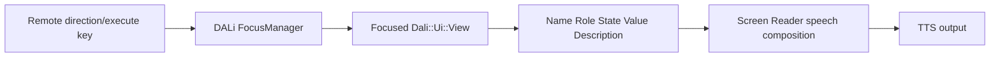

[→ 한국어 문서](https://github.sec.samsung.net/NUI/dali-ui/wiki/Accessibility-(kr))

# Accessibility

> Audience: TV Application developers and Component developers using DALi UI
> Baseline date: 2026-08-04
> Implementation baseline: `dali-ui` `5fd24a718692`
> Status: Current with known component gaps

This guide defines shared accessibility requirements for Application developers who compose TV screens and Component developers who build reusable UI. It covers accessibility fundamentals, TV UX specifications, DALi UI implementation, and validation in one flow. Every implementation example uses the C++ `Dali::Ui` API.

<br/>

## 1. Quick Start

Reader | Read first | Completion evidence
--|--|--
Application developer | Accessibility basics → TV UX specification → Application developer guide → Validation | Complete the core task using only the remote and Screen Reader
Component developer | Accessibility basics → TV UX specification → Component developer guide → Validation | Satisfy the role, state, action, and tree contract

Keep these principles in mind:

1. Always provide accessibility information—such as Name, Role, State, Value, and Description—regardless of whether the Screen Reader is enabled.
2. Keep Name short; do not concatenate Role, State, or Value into it.
3. Do not treat TV remote keyboard focus and accessibility highlight as the same state.
4. Applications own screen context and content semantics; Components own default semantics and the action contract.
5. After setting APIs, verify both the AT-SPI tree and actual TV Screen Reader behavior.

<br/>

## 2. Accessibility Basics

### 2.1 What accessibility means

Accessibility means designing and implementing products and services so people can use them regardless of disability. On a TV, users must be able to understand their current position, explore content, and perform an intended action with the remote without relying on sight.

### 2.2 Screen Reader and TTS

TTS is a technology that converts supplied text into speech. A Screen Reader is an accessibility tool that explores UI objects, composes speech from semantics and the current context, and sends user input back as actions.

```text
TTS: application supplies a completed sentence → speech output
Screen Reader: UI semantics + current context → speech, navigation, and action
```

Applications and Components should therefore expose accurate meaning and state instead of assembling final speech sentences or calling TTS separately for each control.

### 2.3 Accessibility semantics

Information | Meaning | TV example
--|--|--
Name | Short name that identifies the target | `"Netflix"`, `"Volume"`
Role | Function of the target | `BUTTON`, `CHECK_BOX`, `ADJUSTABLE`
State | Current selection, checked, or enabled state | `CHECKED`, `SELECTED`, `ENABLED`
Value | Adjustable or progress value | `"50%"`, `"3/10"`
Description | Supporting explanation or essential usage guidance | `"Opens available networks"`

If the expected speech is “Volume, adjustable, 50%,” do not put the full sentence in Name. Set Name to `"Volume"`, Role to `ADJUSTABLE`, and Value to `"50%"`. The Screen Reader and locale policy determine the final wording and order.

### 2.4 AT-SPI

AT-SPI is the accessibility interface through which assistive technology such as a Screen Reader interacts with UI applications on Linux/Tizen. The Application declares semantics on DALi Views, and DALi UI plus the adaptor translate them into the accessibility tree and AT-SPI interfaces. General Applications and Components do not implement D-Bus protocols or AT-SPI objects directly.

<br/>

## 3. Tizen TV Accessibility Runtime

### 3.1 TV remote focus flow

A typical TV remote navigation flow is shown below. Product branches may differ in Screen Reader integration details, but the Application and Component contract remains the same.



Direction keys move keyboard focus through `FocusManager`. When the Screen Reader is active, it uses the current target semantics to explain where the user is and what they can do. Execution keys, touch, and accessibility actions must converge on the same feature and state-update path.

### 3.2 Keyboard focus and accessibility highlight

> [!IMPORTANT]
> **Keyboard focus and accessibility highlight are separate states.** `FocusManager` focus determines the target of remote and key input. Accessibility highlight represents the target read by the Screen Reader. Making a View focusable does not create accessibility semantics, and moving accessibility highlight does not automatically move keyboard focus.

State which one is meant in TV UX specifications and test reports. Saying only “move focus” can hide a mismatch between remote focus and Screen Reader highlight.

<br/>

## 4. TV Accessibility UX Specification

If UX delivers only visual layout, developers and QA must guess the accessibility navigation unit and speech. Record the following information in every screen or Component specification.

UX field | Required decision | Example
--|--|--
Directional focus | Left/right/up/down target and boundary behavior | The last modal item cannot escape to the background
Initial focus | First target after entering a screen or modal | Dialog title or primary action
Focus restoration | Target after close or back | Button that opened the dialog
Grouping | One representative root or individually navigable children | Settings icon + label + toggle form one target
Image treatment | Informative name or decorative exclusion | Describe a sale banner; hide a divider from the tree
Semantic expectation | Name, Role, State, Value, Description | Name `Volume`, Role `ADJUSTABLE`, Value `50%`
State feedback | Semantics that change immediately after an action | Update `CHECKED` after toggling
Repeated content | Heading, collection name, and index policy | Episode card `3/10`
Dynamic content | Announcement frequency and interruption policy | Do not announce call duration every second

### 4.1 Directional, initial, and restored focus

- Design directional focus around the user task order, not only geometric proximity.
- Select one logical first target when entering a screen, tab, or modal.
- After closing a modal or child screen, restore the originating target or the next target appropriate to the task.
- Document wraparound, boundary exits, and exceptional paths with arrows or a table.

### 4.2 Grouping and navigation units

If an icon, label, and toggle represent one setting, let one root expose the Name, Role, State, and action, and prevent decorative internals from becoming duplicate navigation targets. If children have separate actions, do not merge them; expose each actionable child independently.

Good grouping reduces navigation effort, but must not hide several actions behind one ambiguous target. Decide using both “information understood in one navigation stop” and “actions that must be independently available.”

### 4.3 Image descriptions

- Give informative images a concise Name with the same purpose as the visual information.
- If important text inside an image is not available elsewhere, include its meaning in the Name.
- Hide purely decorative or redundant images from the accessibility tree.
- Do not repeat words such as `"image"` or `"icon"` in Name when Role already conveys them.

### 4.4 Expected speech and state feedback

An expected utterance is a UX review aid. The implementation contract is the set of semantic parts used to compose it.

```text
UX expectation: "Volume, adjustable, 50%"
Implementation: Name="Volume", Role=ADJUSTABLE, Value="50%"
```

After selection, checked, expanded, or value actions, update visual state and semantics in the same model update. If product-specific result speech is required, verify that it neither duplicates the default semantic feedback nor interrupts other important speech.

### 4.5 Repeated and dynamic content

- Divide long screens with headings and meaningful collections.
- Give repeated cards distinguishable Names and current collection indices.
- Rebind all semantics on recycled Views so the previous item Name, State, Value, or index cannot remain.
- For timers, progress, and live status, decide which changes matter and limit announcement frequency.
- For long loading operations, provide `BUSY` state and understandable information about the current operation.

<br/>

## 5. DALi UI API Overview

The `Dali::Ui::View` Accessibility APIs expose a View's semantics, reading information, states, and relations to the accessibility tree. A Screen Reader queries this information to announce the currently highlighted View and sends accessibility actions back to the View.

```cpp
#include <dali-ui-foundation/dali-ui-foundation.h>

using namespace Dali;
using namespace Dali::Ui;

View button = View::New();
button.SetAccessibilityRole(Accessibility::Role::BUTTON);
button.SetAccessibilityName("Confirm");
button.SetAccessibilityDescription("Saves the entered information");
button.AddAccessibilityReadingInfo(Accessibility::ReadingInfo::NAME);
button.AddAccessibilityReadingInfo(Accessibility::ReadingInfo::ROLE);
button.AddAccessibilityReadingInfo(Accessibility::ReadingInfo::DESCRIPTION);

window.Add(button);
```

See [Tizen TV Accessibility Runtime](#3-tizen-tv-accessibility-runtime) for the distinction between keyboard focus and accessibility highlight.

<br/>

## 6. Basic Information

The basic information a Screen Reader needs to understand a View consists of its name, description, value, and role.

API | Purpose | Example
--|--|--
`SetAccessibilityName()` | A short name that identifies the target | `"Wi-Fi"`
`SetAccessibilityDescription()` | Additional explanation of the name | `"Opens available networks"`
`SetAccessibilityValue()` | The current value | `"50%"`, `"On"`
`SetAccessibilityRole()` | The target's meaning and supported behavior | `BUTTON`, `ENTRY`, `ADJUSTABLE`

```cpp
View volume = View::New();
volume.SetAccessibilityRole(Accessibility::Role::ADJUSTABLE);
volume.SetAccessibilityName("Volume");
volume.SetAccessibilityValue("50%");
```

Choose a role based on the functionality presented to the user, rather than the View's implementation class. For example, a clickable control built from a plain `View` should use `BUTTON` if it behaves as a button.

Common roles include:

Category | Role
--|--
Action/selection | `BUTTON`, `TOGGLE_BUTTON`, `CHECK_BOX`, `RADIO_BUTTON`, `LINK`
Input/value | `ENTRY`, `PASSWORD_TEXT`, `ADJUSTABLE`, `SPIN_BUTTON`, `PROGRESS_BAR`, `SCROLL_BAR`
Structure | `CONTAINER`, `LIST`, `LIST_ITEM`, `TAB_LIST`, `TAB`, `MENU`, `MENU_ITEM`, `TOOL_BAR`
Content | `TEXT`, `IMAGE`, `HEADER`, `SCENE_3D`, `MODEL`
Context | `ALERT`, `NOTIFICATION`, `DIALOG`, `POPUP_MENU`

See `Accessibility::Role` for the complete list. Assigning a meaningful role also makes the View highlightable by default.

> [!NOTE]
> Use `OnAccessibilityRequestDefaultName()` and `OnAccessibilityRequestDefaultDescription()` when visible Component content supplies the default Name or Description. Reserve `OnAccessibilityRequestName/Description/Value()` for authoritative values that must take precedence over explicit properties. See [Dynamic Values and Default Component Name/Description](#165-dynamic-values-and-default-component-namedescription) for the resolution order.

<br/>

## 7. Accessibility Behavior Properties

```cpp
view.SetAccessibilityHidden(false);
view.SetAccessibilityHighlightable(true);
view.SetAccessibilityScrollable(false);
view.SetAccessibilityModal(false);
view.SetAutomationId("settings-wifi-button");
```

API | Description
--|--
`SetAccessibilityHidden(bool)` | Hides the View from accessibility clients when set to `true`. Use it for decorative Views that should not be read.
`SetAccessibilityHighlightable(bool)` | Explicitly overrides role-based highlight eligibility.
`ResetAccessibilityHighlightable()` | Removes the override and restores role-based behavior. A role other than `NONE` is highlightable by default.
`SetAccessibilityScrollable(bool)` | Indicates that the View exposes accessibility scrolling behavior.
`SetAccessibilityModal(bool)` | Indicates a modal context that should constrain accessibility navigation.
`SetAutomationId()` | Sets a stable identifier for UI automation tools.

Each setter has a corresponding `Is...()` or `Get...()` API.

> [!WARNING]
> `SetAccessibilityHidden(true)` does not change the View's visual visibility. Likewise, a visually hidden View should not normally remain exposed to accessibility. Keep visual and accessibility exposure consistent.

<br/>

## 8. Selecting Information to Announce

`Accessibility::ReadingInfo` selects which semantic information a Screen Reader should use when reading a View. The enum is not a bit mask; use the per-item APIs.

```cpp
view.AddAccessibilityReadingInfo(Accessibility::ReadingInfo::NAME);
view.AddAccessibilityReadingInfo(Accessibility::ReadingInfo::ROLE);
view.AddAccessibilityReadingInfo(Accessibility::ReadingInfo::DESCRIPTION);
view.AddAccessibilityReadingInfo(Accessibility::ReadingInfo::STATE);

view.RemoveAccessibilityReadingInfo(Accessibility::ReadingInfo::DESCRIPTION);

if(view.HasAccessibilityReadingInfo(Accessibility::ReadingInfo::STATE))
{
  // STATE is included in the reading information.
}

view.ClearAccessibilityReadingInfo();
```

Item | Information exposed
--|--
`NAME` | `AccessibilityName`
`ROLE` | `AccessibilityRole`
`DESCRIPTION` | `AccessibilityDescription`
`STATE` | Current accessibility state

<br/>

## 9. State Management

Use `AddAccessibilityState()`, `RemoveAccessibilityState()`, and `ClearAccessibilityStates()` for semantic states owned by the application or component.

```cpp
checkBox.AddAccessibilityState(Accessibility::State::ENABLED);
checkBox.AddAccessibilityState(Accessibility::State::CHECKED);

checkBox.RemoveAccessibilityState(Accessibility::State::CHECKED);
bool checked = checkBox.HasAccessibilityState(Accessibility::State::CHECKED);
```

State | When to use it
--|--
`ENABLED` | Accessibility interaction is available
`SELECTED` | A list item, tab, or similar item is selected
`CHECKED` | A check or toggle value is on
`BUSY` | A value or content is still being updated
`EXPANDED` | Collapsible content is currently expanded

These application states are combined with DALi runtime states such as visibility, sensitivity, and focus before being exposed to accessibility clients. Do not use these APIs to add runtime states such as `FOCUSED`, `SHOWING`, or `HIGHLIGHTED` directly.

<br/>

## 10. Relations Between Views

Use `Accessibility::RelationType` when the relationship between Views cannot be inferred from their visual layout.

```cpp
View title = Label::New("Password");
View input = View::New();
View error = Label::New("Enter at least 8 characters");

title.AddAccessibilityRelation(Accessibility::RelationType::LABEL_FOR, input);
input.AddAccessibilityRelation(Accessibility::RelationType::LABELLED_BY, title);

error.AddAccessibilityRelation(Accessibility::RelationType::ERROR_MESSAGE, input);
input.AddAccessibilityRelation(Accessibility::RelationType::ERROR_FOR, error);
```

Common relation pairs are:

Source → target | Target → source
--|--
`LABEL_FOR` | `LABELLED_BY`
`DESCRIPTION_FOR` | `DESCRIBED_BY`
`CONTROLLER_FOR` | `CONTROLLED_BY`
`FLOWS_TO` | `FLOWS_FROM`
`NODE_PARENT_OF` | `NODE_CHILD_OF`
`EMBEDS` | `EMBEDDED_BY`
`DETAILS` | `DETAILS_FOR`
`ERROR_MESSAGE` | `ERROR_FOR`

Relations are stored one direction at a time. Add the corresponding inverse relation separately, as shown above, when clients need to query the relationship from both sides.

```cpp
input.RemoveAccessibilityRelation(Accessibility::RelationType::LABELLED_BY, title);
input.ClearAccessibilityRelations();
bool exists = input.HasAccessibilityRelation(Accessibility::RelationType::LABELLED_BY, title);
```

Targets are stored as weak handles, so a relation does not extend the lifetime of its target View.

<br/>

## 11. Multilingual Accessibility Strings

### 11.1 Binding Translation Resources

Binding the name and description to `UiLocalizationManager` resources refreshes their translated values when the locale changes.

```cpp
view.SetTranslatableAccessibilityName("IDS_SETTINGS_WIFI", "settings");
view.SetTranslatableAccessibilityDescription("IDS_SETTINGS_WIFI_DESCRIPTION", "settings");

Dali::String nameResourceId = view.GetTranslatableAccessibilityName();

view.ClearTranslatableAccessibilityName();
view.ClearTranslatableAccessibilityDescription();
```

Omitting the domain uses the default domain. Calling `SetAccessibilityName()` or `SetAccessibilityDescription()` with an explicit string clears its translation binding and language spans. See [Localization & Multilingual UI](https://github.sec.samsung.net/NUI/dali-ui/wiki/Localization-&-Multilingual-UI) for localization setup.

To reuse a string the platform screen reader already translates, look it up with `Extension::ScreenReaderLocalization` and set the result explicitly.

```cpp
#include <dali-ui-foundation/extension-api/screen-reader-localization.h>

view.SetAccessibilityName(Extension::ScreenReaderLocalization::GetLocalizedString("IDS_ACCS_TBOPT_BUTTON"));
```

That catalog belongs to the platform screen reader package, so the lookup falls back to the resource id wherever the package is absent, and the result is a plain string rather than a binding that refreshes on locale change. See [Screen Reader Catalog Lookup](https://github.sec.samsung.net/NUI/dali-ui/wiki/Localization-&-Multilingual-UI#screen-reader-catalog-lookup).

### 11.2 Language Ranges Within One String

Add language spans when a single name or description contains multiple languages.

```cpp
view.SetAccessibilityName("Hello 세계");

bool english = view.AddAccessibilityNameLanguageSpan(0u, 5u, "en-US");
bool korean  = view.AddAccessibilityNameLanguageSpan(6u, 2u, "ko-KR");
```

`start` and `length` use **Unicode code-point indices**, not UTF-8 byte offsets. The API returns `false` when the length is zero, the locale is empty, the range exceeds the string, or the span overlaps an existing span.

Use `AddAccessibilityDescriptionLanguageSpan()` for the description. Changing the string removes its existing spans, so set the string before adding spans.

```cpp
view.ClearAccessibilityNameLanguageSpans();
view.ClearAccessibilityDescriptionLanguageSpans();
```

<br/>

## 12. Collection Information

For repeated items such as lists, identify the collection container and assign zero-based item indices.

```cpp
list.SetAccessibilityCollectionContainer(true);

for(int32_t index = 0; index < itemCount; ++index)
{
  items[index].SetAccessibilityCollectionIndex(index);
}

items[0].ClearAccessibilityCollectionIndex(); // Get returns -1.
```

`SetAccessibilityCollectionIndex(-1)` also clears the index. Update indices after insertion, removal, or reordering so they continue to match the actual item order.

<br/>

## 13. Initial Highlight and Runtime Highlight Movement

Use a different API depending on when the highlight is requested.

Situation | API | Behavior
--|--|--
A page, window, or modal is first shown | `View::SetRequestInitialAccessibilityHighlight(true)` | Provides metadata for the Screen Reader to select the initial target while building its accessibility context.
Move immediately within an already visible, stable screen | `Extension::View::GrabAccessibilityHighlight(view)` | Moves the current DALi accessibility highlight to the target and reports the `HIGHLIGHTED` change to clients.

### 13.1 Initial Highlight for a Page

Mark the initial target before the page appears in the accessibility tree.

```cpp
View title = Label::New("Network settings");
title.SetAccessibilityRole(Accessibility::Role::HEADER);
title.SetRequestInitialAccessibilityHighlight(true);

page.Add(title);
window.Add(page);
```

Call `SetRequestInitialAccessibilityHighlight(false)` when the View is reused or is no longer the initial target. If multiple Views in the same context request initial highlight, the Screen Reader policy determines the final selection. Prefer one logical initial target per context.

> [!IMPORTANT]
> Calling `GrabAccessibilityHighlight()` at the same time as `SHOWING` for a new page or modal can race with the Screen Reader's asynchronous context reconstruction and announcement work. Use `SetRequestInitialAccessibilityHighlight()` for an initial screen. Reserve `GrabAccessibilityHighlight()` for explicit actions after the screen structure is stable. Do not use an arbitrary timeout to enforce ordering.

### 13.2 Forcing Runtime Highlight Movement

This function is an extension API, so include its extension header.

```cpp
#include <dali-ui-foundation/extension-api/view.h>

bool moved = Dali::Ui::Extension::View::GrabAccessibilityHighlight(targetView);
if(!moved)
{
  // The Screen Reader bridge is inactive, or highlight could not be applied.
}
```

If another View is highlighted, DALi clears the old highlight before moving to the new View. `AccessibilityHighlightedSignal()` is emitted with `false` for the previous View and `true` for the new View, and accessibility clients receive the `HIGHLIGHTED` state change. A Screen Reader can use that change to announce the new target.

> [!NOTE]
> The target does not have to be keyboard focusable, and keyboard focus is not moved. Use a View that is exposed in a stable accessibility tree. Manage normal Screen Reader navigation eligibility separately with `SetAccessibilityHighlightable()`.

The return value means:

* `true`: The requested View has DALi accessibility highlight.
* `false`: The accessibility bridge is inactive, or DALi could not apply or clear highlight.

`true` is not an acknowledgement that the Screen Reader started or completed speech. If the same View is already highlighted, the function returns `true` without sending another `HIGHLIGHTED` event, so it is not a re-announcement API.

```cpp
bool cleared = Dali::Ui::Extension::View::ClearAccessibilityHighlight(targetView);
```

`ClearAccessibilityHighlight()` returns `true` only when the target View was currently highlighted and the highlight was cleared.

<br/>

## 14. Accessibility Signals

### 14.1 Highlight Changes

```cpp
view.AccessibilityHighlightedSignal().Connect(
  &tracker,
  [](View source, bool highlighted)
  {
    // The accessibility highlight state of source changed.
  });
```

The signal type is `Signal<void(View, bool)>`. It is emitted when Screen Reader navigation or an extension highlight API actually changes the state. The signal is a state-change notification; applications should not call `Emit()` directly.

### 14.2 Reading Lifecycle

```cpp
view.AccessibilityReadingStatusChangedSignal().Connect(
  &tracker,
  [](View source, Accessibility::ReadingStatus status)
  {
    switch(status)
    {
      case Accessibility::ReadingStatus::PAUSED:
        break;
      case Accessibility::ReadingStatus::RESUMED:
        break;
      default:
        break;
    }
  });
```

The signal type is `Signal<void(View, Accessibility::ReadingStatus)>` and reports:

Status | Meaning
--|--
`SKIPPED` | Reading was skipped before completion
`PAUSED` | Reading was paused
`RESUMED` | Paused reading resumed
`CANCELLED` | Pending or active reading was cancelled
`STOPPED` | Reading stopped or completed

<br/>

## 15. Application Developer Guide

An Application declares screen content semantics and the active context on DALi Views instead of implementing accessibility interfaces directly. It must also verify that each selected Component provides the required action contract.

### 15.1 Application and Component responsibility boundary

Application owns | Component or framework owns
--|--
Screen content Name, Value, and State | Default Role and action implementation for the feature
Active page and modal subtree | AT-SPI object and D-Bus bridge
Initial remote focus, initial accessibility highlight, and return target | One feature path for touch, key, and accessibility actions
Informative versus decorative image treatment | Default accessibility-tree exposure of internal children
Verification of the selected Component contract | Semantic synchronization during reuse and recycling

Do not do the following in Application code:

- Implement or control `Dali::Accessibility::Accessible` or the adaptor bridge directly
- Set semantics only when the Screen Reader is enabled
- Build a final speech sentence by appending Role, State, or Value to Name
- Move highlight after a page transition using an arbitrary timeout
- Assume that a control is adjustable merely because Role and Value were set

### 15.2 Setting screen content semantics

Set screen-specific content on a Component or View that already implements its feature.

```cpp
#include <string>

void ConfigureVolumeControl(View control, int volume)
{
  control.SetAccessibilityRole(Accessibility::Role::ADJUSTABLE);
  control.SetAccessibilityName("Volume");
  control.SetAccessibilityValue((std::to_string(volume) + "%").c_str());
  control.SetAutomationId("settings.sound.volume");
}
```

This code declares screen semantics. The Component must implement increase and decrease through `OnAccessibilityValueChange()`. Role and Value do not create the action.

Hide duplicate internals when one root is the navigation unit for a compound setting.

```cpp
void ConfigureAudioDescriptionSetting(View control,
                                      View icon,
                                      View visibleLabel,
                                      bool checked)
{
  control.SetAccessibilityRole(Accessibility::Role::TOGGLE_BUTTON);
  control.SetAccessibilityName("Audio description");

  if(checked)
  {
    control.AddAccessibilityState(Accessibility::State::CHECKED);
  }
  else
  {
    control.RemoveAccessibilityState(Accessibility::State::CHECKED);
  }

  icon.SetAccessibilityHidden(true);
  visibleLabel.SetAccessibilityHidden(true);
}
```

Use this grouping only when the root provides the actual toggle action. Keep the icon or label accessible if either has an independent action.

### 15.3 Page and remote focus lifecycle

Manage visual visibility and the accessibility subtree together so covered pages cannot be explored.

```cpp
void SetPageActive(View page, bool active)
{
  page.SetVisible(active);
  page.SetAccessibilityHidden(!active);
}
```

Choose one initial accessibility target before showing a new page.

```cpp
Label title = Label::New("Network settings");
title.SetAccessibilityRole(Accessibility::Role::HEADER);
title.SetRequestInitialAccessibilityHighlight(true);
page.Add(title);
```

Request initial remote keyboard focus separately through `FocusManager`.

```cpp
bool FocusFirstControl(View firstControl)
{
  return FocusManager::Get().RequestFocus(firstControl);
}
```

`SetRequestInitialAccessibilityHighlight()` and `RequestFocus()` control different targets. Even if UX requires the same View for both, verify each contract separately.

### 15.4 Modal, list, and background

When opening a modal:

1. Set a meaningful Role such as `DIALOG`, `ALERT`, or `POPUP_MENU` and the modal state on the root.
2. Use a focus group and directional neighbors so remote focus cannot escape the modal.
3. Hide the background page accessibility subtree.
4. Define the initial modal target and close or escape action.
5. On close, expose the previous page and restore remote focus to the originating control.

For lists, keep the collection container and item indices aligned with logical order. Rebind index and all semantics after insertion, deletion, sorting, or recycling. In pause, background, and preload states, users must not be able to explore a root subtree that is not visible to them.

### 15.5 Application completion checklist

- [ ] Every interactive target has a meaningful Role and concise Name.
- [ ] State and Value update in the same transaction as the visual model.
- [ ] Remote directional focus follows UX order and does not become trapped at boundaries.
- [ ] Initial keyboard focus and initial accessibility highlight have explicit intent.
- [ ] Covered pages, modal backgrounds, and decorative images are not navigable.
- [ ] Selected Components implement required actions such as activate, increment/decrement, scroll, and escape.
- [ ] Semantics remain current after locale changes, long or empty values, and pause/resume.
- [ ] The core task is complete on a physical TV using only the remote and Screen Reader.

<br/>

## 16. Component Developer Guide

A reusable Component must provide an accessibility contract that Applications can use consistently without knowing its internal implementation.

### 16.1 Minimum Component contract

1. Set a default Role that matches the feature.
2. Provide reasonable default Name, Description, and Value from visible text or the model while respecting explicit Application overrides.
3. Route touch, remote key, API, and accessibility actions to the same feature path.
4. Update checked, selected, expanded, enabled, and value semantics with visual state.
5. Define an accessibility-tree policy that prevents duplicate internal icons, labels, or layers.
6. Keep semantics and geometry current after layout, animation, recycling, and show/hide.
7. Do not expose AT-SPI objects or adaptor bridge details to Applications.

Role | Required information and state | Required action contract
--|--|--
`BUTTON`, `LINK`, `MENU_ITEM` | Name, enabled | `InteractiveView` click or custom `OnAccessibilityActivate()`
`CHECK_BOX`, `TOGGLE_BUTTON`, `RADIO_BUTTON` | Name, checked, enabled | Synchronize selection and state through interactive click
`ADJUSTABLE`, `SPIN_BUTTON`, `SCROLL_BAR` | Name, Value, enabled | `OnAccessibilityValueChange()`
Scroll container | Scrollable and collection information | `OnAccessibilityScrollToChild()`
Modal root | Context Role and modal/showing lifecycle | `OnAccessibilityEscape()` when required

Setting Role provides meaning and the default highlight policy, but it does not implement Component-specific actions. However, the default activate path of a View with an interactive trait requests keyboard focus and emits `ClickedSignal()` when the View is enabled and clickable.

### 16.2 One activation path

An executable Component should route remote/touch and accessibility activation to the same internal function.

```cpp
#include <dali-ui-foundation/extension-api/interactive-view-impl.h>

void ActionButtonImpl::OnInitialize()
{
  Dali::Ui::Extension::InteractiveViewImpl::OnInitialize();

  auto self = Dali::Ui::View::DownCast(Self());
  self.SetAccessibilityRole(Dali::Ui::Accessibility::Role::BUTTON);

  mLabel = Dali::Ui::Label::New();
  mLabel.SetAccessibilityHidden(true);
  self.Add(mLabel);

  ClickedSignal().Connect(
    this,
    [this](Dali::Ui::View, Dali::Ui::InputEvent event)
    {
      Activate(event);
    });
}
```

The default `ViewImpl::OnAccessibilityActivate()` requests keyboard focus, checks the interactive trait's enabled and clickable states, and then emits the same `ClickedSignal()`. The `InputEvent` type is `ACCESSIBILITY_ACTIVATION`, and this path does not create a pressed state. A regular button therefore does not need an accessibility-specific override or a synthesized `Programmatic()` click.

Override `OnAccessibilityActivate()` only when activation performs something other than click or intentionally replaces the default focus/click path. An override returns `true` only when it handles the request and explicitly decides whether to call the base implementation when default behavior must be preserved.

### 16.3 Toggle and checked state

By default, `SelectableView` toggles selection through click while toggle-by-click is enabled. Accessibility activation uses the same click path, so update visuals and accessibility state from `SelectionChangedSignal()`. If `SetToggleByClickEnabled(false)` disables this behavior, the Component must provide its own selection path.

```cpp
#include <dali-ui-foundation/extension-api/selectable-view-impl.h>

void ToggleImpl::OnInitialize()
{
  Dali::Ui::Extension::SelectableViewImpl::OnInitialize();

  auto self = Dali::Ui::View::DownCast(Self());
  self.SetAccessibilityRole(Dali::Ui::Accessibility::Role::CHECK_BOX);

  SelectionChangedSignal().Connect(this, &ToggleImpl::OnSelectionChanged);
}

void ToggleImpl::OnSelectionChanged(Dali::Ui::View self,
                                    bool selected,
                                    Dali::Ui::InputEvent event)
{
  UpdateVisualState(selected, event);
  if(selected)
  {
    self.AddAccessibilityState(Dali::Ui::Accessibility::State::CHECKED);
  }
  else
  {
    self.RemoveAccessibilityState(Dali::Ui::Accessibility::State::CHECKED);
  }
}
```

`SelectableView::IsSelected()` and accessibility `CHECKED` do not become the same state automatically. Synchronize them explicitly from the selection signal according to the Component Role. `GroupSelectableTrait` maps `CHECKED` for radio buttons, but it does not supply every semantic required by a general selectable control.

`CHECKED` and `SELECTED` do not represent focus. Use `CHECKED` for controls whose value can be checked or turned on, such as checkboxes, toggle buttons, and radio buttons. Use `SELECTED` for an item selected by a list or tab selection model. Do not set `SELECTED` merely because an item has remote focus.

When changing whether a Component is available for interaction, update both `SetEnabled()` and the accessibility `ENABLED` state from the same logical state. Managing them independently can make the actual interaction behavior disagree with the information conveyed by the Screen Reader.

### 16.4 Adjustable values

Apply the minimum and maximum, and return success only when the value changes.

```cpp
#include <algorithm>
#include <string>

bool VolumeSliderImpl::OnAccessibilityValueChange(bool increased)
{
  auto self = Dali::Ui::View::DownCast(Self());
  if(!self.IsEnabled())
  {
    return false;
  }

  const int oldValue = mValue;
  mValue = std::clamp(mValue + (increased ? mStep : -mStep), mMin, mMax);
  if(mValue == oldValue)
  {
    return false;
  }

  UpdateThumbFromValue();
  const std::string spokenValue = std::to_string(mValue) + "%";
  self.SetAccessibilityValue(spokenValue.c_str());
  return true;
}
```

During initialization, provide an `ADJUSTABLE` or `SPIN_BUTTON` Role, Name, and initial Value. If the Component does not refresh `SetAccessibilityValue()` after a change, the Screen Reader may announce the previous value.

### 16.5 Dynamic Values and Default Component Name/Description

For static or explicit values set by an Application, use the public-handle setters `SetAccessibilityName()`, `SetAccessibilityDescription()`, and `SetAccessibilityValue()`. When a Component can derive a reasonable default Name or Description from visible content, use a default hook.

```cpp
bool TextActionImpl::OnAccessibilityRequestDefaultName(Dali::String& value)
{
  value = mLabel.GetText();
  return !value.Empty();
}
```

`OnAccessibilityRequestDefaultName()` and `OnAccessibilityRequestDefaultDescription()` run only when the authoritative request did not handle the value and the explicit property is empty. A Component fallback therefore does not override an Application's `SetAccessibilityName()` or `SetAccessibilityDescription()` value.

When a default hook returns `true`, its output is final even when the string is empty. Return `false` to continue to the integration raw fallback or Actor Name.

Use a request hook only for an authoritative value that must be computed when the Screen Reader queries it and must take precedence over an explicit property.

```cpp
bool StatusViewImpl::OnAccessibilityRequestValue(Dali::String& value)
{
  value = BuildCurrentStatusText();
  return true;
}
```

Request hooks follow these return rules:

- `true`: Use the output as the final value. An empty string is also an intentionally handled value.
- `false`: Fall back to the stored explicit or translated property. If a Name or Description property is empty, continue to its default hook and framework fallbacks.

When `OnAccessibilityRequestName()`, `OnAccessibilityRequestDescription()`, or `OnAccessibilityRequestValue()` returns `true`, it takes precedence over the explicit property. Do not use these hooks for an ordinary visible-text fallback because doing so hides an Application override; use a default hook instead.

The final resolution order is:

Information | Resolution order
--|--
Name | Authoritative request → explicit or translated property → Component default hook → integration raw fallback → Actor Name
Description | Authoritative request → explicit or translated property → Component default hook → integration raw fallback
Value | Authoritative request → stored property

### 16.6 Compound trees and recycling

Subject | Contract | Failure signal
--|--|--
Compound root | Choose either the root or actionable children as navigation units | Root, label, and icon repeat the same speech
Collection | Keep container and index aligned with logical order | Highlight disappears at a viewport boundary
Recycling | Rebind Name, State, Value, and index with item data | Previous item semantics remain
Modal | Manage background exclusion, initial target, escape, and restoration as one lifecycle | Focus escapes to the background or disappears after close

A scrollable Component implements both `SetAccessibilityScrollable(true)` and `OnAccessibilityScrollToChild(View)`. The latter must make the target child visible in the viewport before returning success. A modal Component provides a meaningful Role and `SetAccessibilityModal(true)`, and runs close/back from `OnAccessibilityEscape()` when required.

### 16.7 Current `devel` caveats

> [!WARNING]
> At `5fd24a718692`, the default activate path of an `InteractiveView`-based Component delivers click when enabled and clickable, and `SelectableView` changes selection through the same click path. However, `TextButton`, `CheckBox`, `Dialog`/`DialogContainer`/`AlertDialog`, `Navigator`, `ScrollView`, and `RecyclerView` do not necessarily provide every required default Role, Name, State, internal-child policy, modal, escape, or scroll-to-child contract. Inspect the target branch and actual Screen Reader actions, then complete missing behavior at the Component layer. Do not claim pan/zoom support before verifying end-to-end dispatch.

### 16.8 Component release checklist

- [ ] Default Role, Name/Value fallback, and highlight policy are explicit.
- [ ] Remote, touch, and accessibility actions produce the same model change.
- [ ] Accessibility activate carries an `ACCESSIBILITY_ACTIVATION` event and does not create an unnecessary pressed transition.
- [ ] Actions are safely rejected while disabled.
- [ ] State and Value update with visuals.
- [ ] Internal children do not produce duplicate speech.
- [ ] Scroll-to-child works at collection boundaries.
- [ ] Recycling, animation, and show/hide leave no stale semantics or geometry.
- [ ] Modal entry, escape, and post-close restoration remain stable after repetition.
- [ ] Unit/integration tests and physical TV Screen Reader tests pass.

<br/>

## 17. Custom View Implementation

To expose non-click accessibility actions, dynamic values, or default semantics from a new Component, use the corresponding virtual API on `ViewImpl`, not on the `View` handle.

```cpp
class VolumeViewImpl : public ViewImpl
{
public:
  bool OnAccessibilityActivate() override
  {
    ToggleMute();
    return true;
  }

  bool OnAccessibilityValueChange(bool isIncreased) override
  {
    ChangeVolume(isIncreased ? 1 : -1);
    return true;
  }

  bool OnAccessibilityRequestValue(Dali::String& value) override
  {
    value = GetVolumeText();
    return true;
  }
};
```

The `OnAccessibilityActivate()` override above is for a custom activation that differs from click. If an `InteractiveView` already routes `ClickedSignal()` to the same feature, use the default activate path and omit this override.

Virtual API | Accessibility request
--|--
`OnAccessibilityActivate()` | Activate the target
`OnAccessibilityEscape()` | Dismiss the current context or navigate back
`OnAccessibilityValueChange(bool isIncreased)` | Increase or decrease a value
`OnAccessibilityScrollToChild(View child)` | Reveal a child of a scroll container
`OnAccessibilityPan(PanGesture)` | Handle an accessibility pan
`OnAccessibilityZoom()` | Handle accessibility zoom
`OnAccessibilityRequestName()` | Query an authoritative Name that precedes explicit properties
`OnAccessibilityRequestDefaultName()` | Supply a Component default when no explicit Name exists
`OnAccessibilityRequestDescription()` | Query an authoritative Description that precedes explicit properties
`OnAccessibilityRequestDefaultDescription()` | Supply a Component default when no explicit Description exists
`OnAccessibilityRequestValue()` | Query a dynamic Value

An action callback returns `true` when it handled the request and `false` when it did not. See [16.5 Dynamic Values and Default Component Name/Description](#165-dynamic-values-and-default-component-namedescription) for string-hook precedence and return rules.

Applications normally do not invoke these virtual functions directly. The Accessibility bridge receives Screen Reader requests and dispatches them to the appropriate callback.

> [!IMPORTANT]
> A regular `ViewImpl` on current `devel` has no custom-accessible-object creation virtual. Only a foundation control that requires an additional AT-SPI interface should have its integration owner use `Integration::ViewAccessibility::SetAccessibleObjectCreator()`. A regular visual Component uses the public semantic APIs and request/default/action hooks without subclassing the accessible adapter.

See [View Architecture](https://github.sec.samsung.net/NUI/dali-ui/wiki/View#4-view-inheritance) for the custom View handle/implementation structure.

<br/>

## 18. Raw Attributes

Use raw attributes only when a required backend attribute has no typed API.

```cpp
view.AppendAccessibilityAttribute("vendor-key", "vendor-value");
view.RemoveAccessibilityAttribute("vendor-key");
```

> [!WARNING]
> `ClearAccessibilityAttributes()` removes not only manually added raw attributes, but also typed attributes such as initial highlight, collection information, and reading information, as well as name and description language spans. To remove one setting, use its typed API or `RemoveAccessibilityAttribute()` instead.

<br/>

## 19. Shared Responsibilities and Completion Criteria

### 19.1 Deliverables by role

Role | Required deliverable
--|--
UX | Directional focus map, grouping, image treatment, semantic expectation, state feedback, modal entry and restoration policy
Application | Screen content semantics, active page tree, Component selection and contract verification, lifecycle integration
Component | Default Role/Name/Value/State/action contract, internal tree policy, recycling behavior
QA | Remote navigation result, final speech, AT-SPI tree, lifecycle and locale results, evidence

### 19.2 Shared checklist

- [ ] The core task is complete using only the remote and Screen Reader without seeing the screen.
- [ ] Visual order, remote focus order, and accessibility-tree order match the user task flow.
- [ ] Name, Role, State, Value, and Description are separated by purpose without duplication.
- [ ] New State and Value are available immediately after an action.
- [ ] Only the active context is navigable after modal, page, background, and resume transitions.
- [ ] Decorative children and internal implementation Views do not produce duplicate speech.
- [ ] Long translations, RTL, empty values, minimum/maximum, and repeated transitions were tested.
- [ ] Every failure links to reproduction steps, a tree dump, logs, and device/build information.

<br/>

## 20. Validation

Accessibility validation does not end when an API value is stored. Verify the Component contract, AT-SPI tree, and actual TV user behavior as three separate layers.

### 20.1 Three-layer validation

Layer | What to verify | Typical evidence
--|--|--
1. Unit/integration | Role, Name, State, Value, action dispatch, disabled and boundary handling | Test log
2. AT-SPI tree | Object exposure, sibling order, state, relation, geometry, hidden subtree | Tree dump
3. Physical TV | Remote focus, final speech, action, modal/page/background lifecycle | Recording, Screen Reader and DALi logs

Use these commands on a Tizen target to inspect the Application and tree.

```sh
at_spi2_tool -l
at_spi2_tool -d com.example.nativeapp
at_spi2_tool -c com.example.nativeapp
```

Inspect Role, Name, State, bounds, collection index, and sibling order. A passing tree check does not replace final speech and remote-action testing. Natural speech does not prove that the tree and action contract are correct.

### 20.2 Required TV scenarios

1. Enable the Screen Reader before launch and after launch in separate runs.
2. Repeat first entry, page push/pop, and modal open/close.
3. Perform every core feature using remote direction and execution keys.
4. Operate toggles and adjustable values at minimum, middle, and maximum.
5. Navigate collection viewport boundaries and recycled items.
6. Exercise Application pause/resume, background, and preload states.
7. Verify Korean, English, major product locales, and long strings.
8. For a failure, narrow the cause in the order tree → DALi log → Screen Reader log.

Do not declare accessibility complete when any of these conditions remains:

- A core action cannot be executed with the remote and Screen Reader
- An incorrect Role, empty Name, or stale State/Value is exposed
- Focus reaches an inactive page or modal background
- Recycled items retain semantics from another item
- A password or other sensitive information appears in the tree, Value, or logs

<br/>

## 21. Troubleshooting

Symptom | What to check
--|--
The View is not announced | Verify that its role and name are set and that `SetAccessibilityHidden(true)` is not active.
Normal navigation does not highlight the View | Check `IsAccessibilityHighlightable()` and the role.
`GrabAccessibilityHighlight()` returns `false` | Verify that the Screen Reader/accessibility bridge is active.
`GrabAccessibilityHighlight()` returns `true` but does not read again | Check whether the same View is already highlighted. This is not a re-announcement API.
A different target is read on a new page | Set `SetRequestInitialAccessibilityHighlight(true)` before showing it instead of calling `GrabAccessibilityHighlight()`.
The key input target does not change | Highlight does not change keyboard focus. Use [FocusManager](https://github.sec.samsung.net/NUI/dali-ui/wiki/Focus-&-Key) separately.
Adding a language span fails | Check the code-point range, empty locale, zero length, and overlap with existing spans.

See the [accessibility-view-api sample](https://github.sec.samsung.net/NUI/dali-ui/tree/devel/samples/accessibility-view-api) for an executable demonstration that reports results on screen and to stdout.

<br/>

---

[← Back to list](https://github.sec.samsung.net/NUI/dali-ui/wiki#development-guides)
